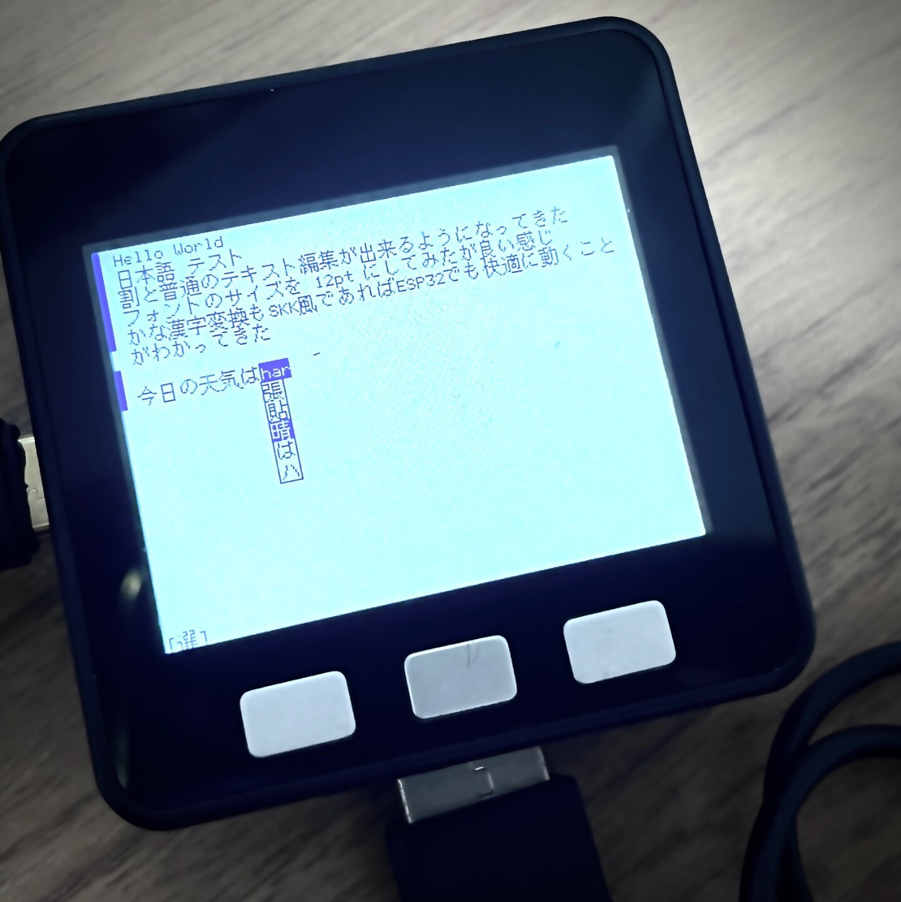

# susu-ki

susu-ki はESP32で動作する、画面、キーボードを前提としたLua実行環境です。

現在はM5Stack + USBモジュールの構成をターゲットにしています。

# 準備

## 辞書のダウンロードと変換
- `bat/skk/` 以下にSKK辞書をダウンロードしてきてください。(`SKK-JISYO.ML`で動作確認しています。)
- `bat/conv.py` をPythonで実行してください
- `bat/dic/` 以下にファイルが作成されます

## SDカードの準備
- `bat/dic` をSDカードのルートに配置してください

## M5Stackの準備
- M5StackにUSBモジュールを接続し、手近なUSBキーボードをつなげてください

## プログラムの書き込み
- `platformio run -t upload` を実行してM5Stackにプログラムを書き込んでください
- `platorimo run -t uploadfs` を実行して `data/` 以下のファイルをSPIFFSに書き込んでください

## プログラムの実行
- 書き込みが終わると自動的に起動します
- ※起動すると SDカードに いくつかのLuaファイルが作成されますが、これはSPIFFSに転送したものがコピーされたものです。編集しても次回実行時にSPIFFSのもので上書きされるので気を付けて下さい